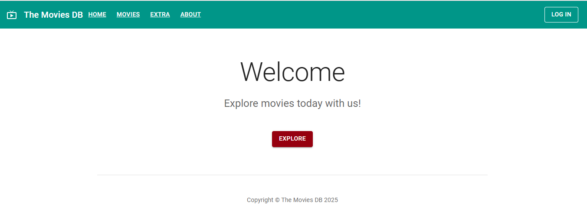
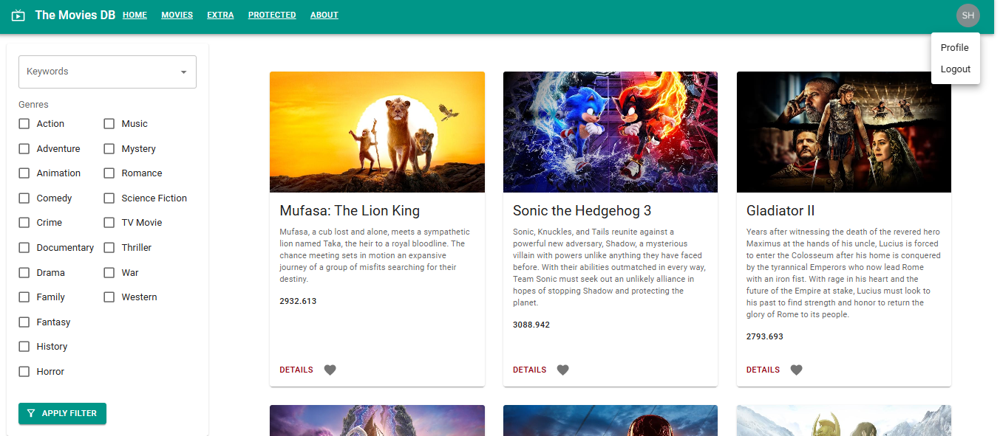
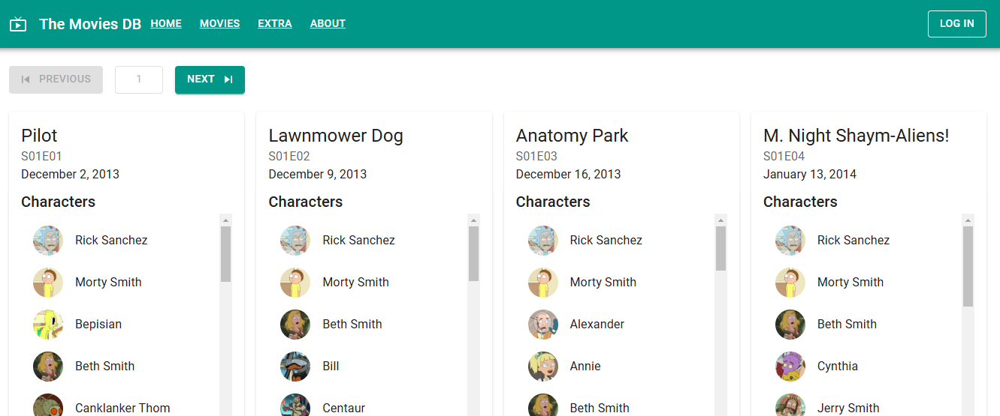

# Movies DB

The Movies DB is a web application based on a public API, utilizing various techniques offered by React and related libraries. It is designed to explore and filter movies, showcasing additional features such as profiles, authentication, and dynamic data fetching from external APIs.

## Table of Contents

- [Features](#features)
- [Technologies Used](#technologies-used)
- [Installation](#installation)
- [Usage](#usage)
- [Demo](#demo)
- [Contributing](#contributing)
- [License](#license)

## Features

- **Home Page**: Welcome message with a call-to-action to explore movies.
- **Movies Page**: Browse and filter movies by genres and keywords.
- **Extra Page**: Access episodes from an external source (e.g., Rick and Morty API).
- **Protected Routes**: Certain pages or interaction with content require authentication.
- **Authentication**: Includes login functionality and state management.
- **Profile Page**: View user-specific information.
- **Responsive Design**: Optimized for various screen sizes.

## Technologies Used

- **React**: A JavaScript library for building user interfaces. Used for developing components and managing the application state.
- **React Router DOM**: A library for routing in React applications, enabling navigation between different pages of the app.
- **React Redux**: A library for state management in large applications, allowing centralized storage and modification of data.
- **Material UI**: A component library for React that follows Material Design principles to build user interfaces.
- **Emotion**: A library for writing styles using the CSS-in-JS approach, allowing for flexible and dynamic styling in React components.
- **GraphQL**: A query language for APIs to fetch data. Used in this project for integrating with public APIs.
- **Redux Toolkit**: A tool that simplifies using Redux, including convenient APIs for creating stores and handling asynchronous operations.
- **Jest**: Testing framework.
- **React Testing Library**: A library for testing React components, making it easier to verify their behavior.
- **MSW (Mock Service Worker)**: A tool for mocking API requests during testing.
- **Leaflet**: A library for integrating maps on web pages, used for displaying maps.
- **LocalForage**: A library for asynchronous storage in the browser, supporting Web Storage, IndexedDB, and WebSQL.
- **Match Sorter**: A library for sorting lists with search and filtering capabilities.
- **@auth0/auth0-react**: A library for integrating Auth0, enabling user authentication in React applications.
- **Babel**: A JavaScript compiler that transpiles modern JavaScript (ES6+) into compatible code for older browsers.
- **APIs**: TMDB, Rick and Morty.

## Installation

1. Clone this repository:

   ```bash
   git clone https://github.com/sh-sofi/movies-db.git
   cd movies-db
   ```

2. Install dependencies:

   ```bash
   npm install
   ```

3. Create a `.env` file in the main directory with the required API keys and configurations:

- REACT_APP_API_URL=https://api.themoviedb.org
- REACT_APP_API_TOKEN=<api-token>

- REACT_APP_AUTH0_DOMAIN=AUTH0-DOMAIN
- REACT_APP_AUTH0_CLIENT_ID=AUTH0-CLIENT-ID
- REACT_APP_AUTH0_CALLBACK_URL=http://localhost:3000/callback

- REACT_APP_AUTH0_AUDIENCE=AUTH0-API-AUDICENCE
- REACT_APP_PROTECTED_API_URL=http://localhost:6060

4. Start the application:
   ```bash
   npm start
   ```

## Usage

Open the app in your browser at http://localhost:3000.

Navigate through the pages: Home, Movies, Extra, and Profile.

Filter movies by genres and keywords on the Movies page.

Use authentication features (e.g., Login) for restricted pages.

## Demo


Home Page Screenshot


Movies page


Extra page

## Contributing

This is a learning project, so contributions are not expected. However, feel free to fork and experiment with it. For suggestions or feedback, please open an issue.

## License

This project is licensed under the MIT License. See the LICENSE file for details.

##

Repository created during the course by ITVDN "React Advanced".

Special thanks to the course instructor for guidance and learning materials. 🙌

